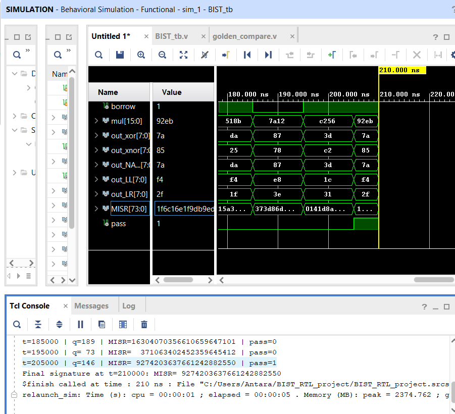

# 8-bit ALU with LFSR/MISR-based Built-In Self-Test (BIST)

A Verilog implementation of a Built-In Self-Test (BIST) architecture for an 8-bit ALU, using a Linear Feedback Shift Register (LFSR) for pseudo-random pattern generation and a 74-bit Multiple Input Signature Register (MISR) for output response compaction and signature analysis.

## Overview

Testing a chip after fabrication normally means feeding it stimulus from external test equipment and checking every output against expected values. **BIST (Built-In Self-Test)** moves both stimulus generation and response checking on-chip, so the circuit can verify itself with minimal external hardware.

This project implements the three classic BIST building blocks around a small ALU:

```
 ┌───────────┐        ┌───────────────┐        ┌─────────────────┐        ┌───────────────┐
 │   LFSR    │─────▶ │   CUT (ALU)   │ ─────▶ │  MISR (74-bit)  │ ─────▶│ Golden compare│
 │  (PRPG)   │        │ Circuit Under │        │ Response        │        │ pass / fail   │
 │           │        │     Test      │        │ Compactor       │        │               │
 └───────────┘        └───────────────┘        └─────────────────┘        └───────────────┘
 pseudo-random          add/sub/mul/              compacted                 compares live
 test patterns          xor/xnor/nand/            signature                 signature vs.
                        shift-left/right                                    stored golden
```

1. **LFSR (Pseudo-Random Pattern Generator)** — generates a long, non-repeating sequence of pseudo-random 8-bit patterns using XOR feedback taps.
2. **CUT — Circuit Under Test (ALU)** — computes add, subtract, multiply, XOR, XNOR, NAND, and logical shifts on the pseudo-random stimulus.
3. **MISR (Multiple Input Signature Register)** — compacts every ALU output bit, every cycle, into a single 74-bit signature via an XOR shift chain with feedback taps.
4. **Golden signature comparator** — compares the live signature against a pre-captured known-good reference and outputs a `pass`/`fail` flag.

## COMPACTION

The ALU produces 74 bits of output per cycle across all its functions (8-bit sum + 1 carry + 8-bit difference + 1 borrow + 16-bit product + 8-bit XOR + 8-bit XNOR + 8-bit NAND + 8-bit shift-left + 8-bit shift-right = 74 bits). Storing every output bit for every cycle of a long test would need a large amount of memory. Signature analysis avoids this: XOR is highly sensitive to any single bit flip anywhere in the response stream, so comparing one final 74-bit signature against a known-good ("golden") signature is, with very high probability, enough to detect whether *any* fault occurred anywhere in the circuit during the test — without storing the full expected response for every cycle.

## Repository Structure

| File | Description |
|---|---|
| `LFSR_input.v` | 8-bit GALOIS -style LFSR with XOR feedback taps at bits 1, 3, and 5. Generates the pseudo-random stimulus applied to the ALU. Seeds to `8'd1` on reset. https://www.ece.unb.ca/tervo/ee4253/polyprime.shtml polynomial x^8 + x^5 + x^3 + x + 1 is primitive|
| `CUT_ALU.v` | The Circuit Under Test — an 8-bit ALU computing sum, difference (with carry/borrow), 16-bit product, XOR, XNOR, NAND, and 2-bit logical shifts. Internally instantiates its own `LFSR_input` to source operands each cycle. |
| `MISR_golden_sign.v` | 74-bit MISR built from `shifter_2` (2-input XOR) and `shifter_3` (3-input XOR, at feedback tap positions 58, 59, 73) cells. Concatenates all ALU outputs into a 74-bit vector each cycle and folds them into the signature register. Internally instantiates its own `CUT_ALU`. https://docs.amd.com/v/u/en-US/xapp052 |
| `golden_compare.v` | Compares a live MISR signature against a pre-captured golden signature constant and outputs `pass`. Represents the realistic, production-style approach — a single stored reference value instead of a permanent duplicate CUT on-chip. |
| `BIST_tb.v` | Top-level testbench. Instantiates the LFSR, the ALU, the MISR, and the comparator, applies a global reset, runs the simulation for 200 ns, and monitors the LFSR output, MISR signature, and pass flag over time. |

## TEST RUNS

1. On reset, the LFSR is seeded (`q <= 8'd1`) and the MISR is cleared (`MISR <= 74'd0`).
2. Every clock edge, the LFSR shifts and produces a new pseudo-random 8-bit value.
3. The ALU consumes the current and previous LFSR values (`q`, `q_past`) and computes all seven operations in parallel.
4. All 74 ALU output bits are concatenated and fed into the MISR's XOR-feedback shift chain, one bit position per output line.
5. After the test window ends, the final value of `MISR` is the circuit's signature for that run.
6. `golden_compare` checks this live signature against `GOLDEN_SIG`, a constant captured once from a known-good simulation run, and asserts `pass` if they match.

### Capturing your own golden signature

`GOLDEN_SIG` in `golden_compare.v` is already populated with a value captured from a known-good 200 ns Vivado run. If you change the test length, the ALU logic, or the LFSR seed, you'll need to recapture it:
1. Run `BIST_tb.v` in simulation on the known-good design.
2. Note the final `MISR` value printed by `$display` at `$finish`.
3. Replace the `GOLDEN_SIG` localparam in `golden_compare.v` with that captured value.
4. Re-run — `pass` will now correctly reflect whether a given run matches the reference. Note `MISR` is a *cumulative* signature, so `pass` is only meaningful at the final cycle of the test window, not throughout the run.

## Signals Reference

**`LFSR_input`**
| Signal | Direction | Width | Description |
|---|---|---|---|
| `clk` | input | 1 | Clock |
| `reset` | input | 1 | Synchronous reset, seeds LFSR to `8'd1` |
| `q` | output | 8 | Current LFSR state / pseudo-random pattern |

**`CUT_ALU`**
| Signal | Direction | Width | Description |
|---|---|---|---|
| `clk`, `reset` | input | 1 | Clock / synchronous reset |
| `sum`, `cout` | output | 8, 1 | Addition result and carry-out |
| `sub`, `borrow` | output | 8, 1 | Subtraction result and borrow-out |
| `mul` | output | 16 | Multiplication result |
| `out_xor` / `out_xnor` / `out_NAND` | output | 8 each | Bitwise logic results |
| `out_LL` / `out_LR` | output | 8 each | Logical shift-left / shift-right by 2 |

**`MISR_golden_sign`**
| Signal | Direction | Width | Description |
|---|---|---|---|
| `clk`, `reset` | input | 1 | Clock / synchronous reset |
| `MISR` | output | 74 | Compacted signature of the ALU's combined output stream |

**`golden_compare`**
| Signal | Direction | Width | Description |
|---|---|---|---|
| `live_signature` | input | 74 | Signature to check, typically wired to `MISR` |
| `pass` | output | 1 | High if `live_signature` matches the stored golden reference |

## Verification

Simulated in Vivado (XSim), 200 ns test window. The golden signature was captured from a known-good run and confirmed to produce pass=1 on a matching re-run:



